<div align="center">

<br/>

```
██████╗  ██████╗  ██████╗██╗   ██╗███████╗ ██████╗ █████╗ ██╗     ███████╗
██╔══██╗██╔═══██╗██╔════╝██║   ██║██╔════╝██╔════╝██╔══██╗██║     ██╔════╝
██║  ██║██║   ██║██║     ██║   ██║███████╗██║     ███████║██║     █████╗  
██║  ██║██║   ██║██║     ██║   ██║╚════██║██║     ██╔══██║██║     ██╔══╝  
██████╔╝╚██████╔╝╚██████╗╚██████╔╝███████║╚██████╗██║  ██║███████╗███████╗
╚═════╝  ╚═════╝  ╚═════╝ ╚═════╝ ╚══════╝ ╚═════╝╚═╝  ╚═╝╚══════╝╚══════╝
```

### **End-to-End Cloud Native DevOps Project**

<br/>

[](https://www.docker.com/)
[](https://kubernetes.io/)
[](https://aws.amazon.com/)
[](https://www.jenkins.io/)
[](https://github.com/features/actions)
[](https://react.dev/)
[](https://nodejs.org/)
[](https://www.postgresql.org/)

<br/>

> *A production-grade deployment workflow — from local dev to AWS EKS — demonstrating every layer of modern DevOps engineering.*

<br/>

</div>

---

## 📸 Live Application

<div align="center">

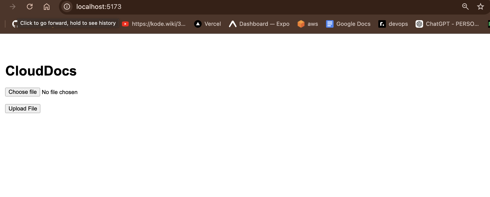

*DocuScale running live on AWS EKS infrastructure*

</div>

---

## 📋 Table of Contents

| # | Section |
|---|---------|
| 1 | [🎯 Project Objectives](#-project-objectives) |
| 2 | [🏗️ Architecture](#️-architecture) |
| 3 | [🧠 Concepts Demonstrated](#-concepts-demonstrated) |
| 4 | [🧰 Tech Stack](#-tech-stack) |
| 5 | [☁️ AWS Infrastructure](#️-aws-infrastructure) |
| 6 | [⚙️ Phase 1 — Local Development](#️-phase-1--local-development) |
| 7 | [🐳 Phase 2 — Dockerization](#-phase-2--dockerization) |
| 8 | [☸️ Phase 3 — Kubernetes](#️-phase-3--kubernetes-deployment) |
| 9 | [☁️ Phase 4 — AWS Cloud](#️-phase-4--aws-cloud-infrastructure) |
| 10 | [🚀 Phase 5 — EKS Cluster](#-phase-5--aws-eks-kubernetes-cluster) |
| 11 | [🔄 Phase 6 — GitHub Actions CI](#-phase-6--github-actions-ci) |
| 12 | [🔧 Phase 7 — Jenkins CD](#-phase-7--jenkins-cd) |
| 13 | [🛡️ Security](#️-security-implementations) |
| 14 | [🧪 Challenges & Debugging](#-challenges--debugging) |
| 15 | [🚀 Future Improvements](#-future-improvements) |

---

## 🎯 Project Objectives

DocuScale demonstrates a **complete, production-grade DevOps lifecycle** — every phase from local development to live cloud deployment, implemented from scratch.

```
Local Dev  →  Docker  →  Kubernetes  →  AWS EKS  →  CI/CD Automation
```

**What this project proves:**

- ✅ Ability to design and implement cloud-native architecture from scratch
- ✅ Deep understanding of container orchestration at scale
- ✅ Real-world CI/CD pipeline design with GitHub Actions + Jenkins
- ✅ Secure AWS infrastructure configuration with IAM, VPC, and Secrets
- ✅ End-to-end DevOps lifecycle ownership

---

## 🏗️ Architecture

<div align="center">

```
┌─────────────────────────────────────────────────────────────────┐
│                      DEVELOPER WORKSTATION                       │
│                      git push → GitHub                          │
└────────────────────────────┬────────────────────────────────────┘
                             │
                             ▼
┌─────────────────────────────────────────────────────────────────┐
│                    GITHUB ACTIONS  (CI)                          │
│         Checkout → Build Images → Push to AWS ECR               │
└────────────────────────────┬────────────────────────────────────┘
                             │
                             ▼
┌─────────────────────────────────────────────────────────────────┐
│                  JENKINS PIPELINE  (CD)  [EC2]                  │
│         Clone Repo → Apply Manifests → Verify Deployment        │
└────────────────────────────┬────────────────────────────────────┘
                             │
                             ▼
┌─────────────────────────────────────────────────────────────────┐
│                     AWS EKS CLUSTER                              │
│   ┌─────────────────┐             ┌─────────────────┐           │
│   │  Frontend Pod   │◄───────────►│  Backend Pod    │           │
│   │  React + Vite   │             │  Node + Express │           │
│   └─────────────────┘             └────────┬────────┘           │
│                                            │                     │
│                                   ┌────────▼────────┐           │
│                                   │  PostgreSQL Pod  │           │
│                                   └────────┬────────┘           │
│                                            │                     │
│                                   ┌────────▼────────┐           │
│                                   │    AWS S3        │           │
│                                   │  File Storage    │           │
│                                   └─────────────────┘           │
│                                                                  │
│        ┌──────────────────────────────────────────┐             │
│        │        Elastic Load Balancer              │             │
│        │        Auto Scaling Group                 │             │
│        └──────────────────────────────────────────┘             │
└─────────────────────────────────────────────────────────────────┘
```

</div>

---

## 🧠 Concepts Demonstrated

<div align="center">

| Domain | Concept | Status |
|--------|---------|:------:|
| **System** | Linux Administration | ✅ |
| **Version Control** | Git & GitHub | ✅ |
| **Containers** | Docker Containerization | ✅ |
| **Containers** | Docker Compose | ✅ |
| **Orchestration** | Kubernetes | ✅ |
| **Cloud** | AWS Cloud Infrastructure | ✅ |
| **Cloud** | AWS EKS (Managed K8s) | ✅ |
| **Cloud** | AWS ECR (Image Registry) | ✅ |
| **Cloud** | AWS EC2 (Compute) | ✅ |
| **Cloud** | AWS S3 (Object Storage) | ✅ |
| **Cloud** | AWS IAM (Access Control) | ✅ |
| **Cloud** | AWS VPC (Networking) | ✅ |
| **Cloud** | Elastic Load Balancer | ✅ |
| **Cloud** | Auto Scaling Group | ✅ |
| **CI/CD** | GitHub Actions | ✅ |
| **CI/CD** | Jenkins Pipeline | ✅ |
| **CLI Tools** | kubectl & eksctl | ✅ |
| **Security** | Kubernetes Secrets | ✅ |
| **Database** | PostgreSQL | ✅ |
| **SDK** | AWS SDK Integration | ✅ |

</div>

---

## 🧰 Tech Stack

<table>
<tr>
<td width="33%" valign="top">

### 🎨 Frontend
- **React** — UI framework
- **Vite** — Build tooling
- **Axios** — HTTP client

</td>
<td width="33%" valign="top">

### ⚙️ Backend
- **Node.js** — Runtime
- **Express.js** — API framework
- **PostgreSQL** — Database
- **AWS SDK** — Cloud integration
- **Multer** — File uploads

</td>
<td width="33%" valign="top">

### 🚢 DevOps & Cloud
- **Docker** + **Docker Compose**
- **Kubernetes** on **AWS EKS**
- **AWS ECR** image registry
- **Jenkins** on **AWS EC2**
- **GitHub Actions**
- **Linux** / **AWS CLI**

</td>
</tr>
</table>

---

## ☁️ AWS Infrastructure

<div align="center">

| Service | Role |
|---------|------|
| **EC2** | Jenkins server hosting |
| **EKS** | Managed Kubernetes cluster |
| **ECR** | Docker image registry |
| **S3** | File storage backend |
| **IAM** | Authentication & least-privilege access |
| **VPC** | Network isolation |
| **Elastic Load Balancer** | External traffic routing |
| **Auto Scaling Group** | Worker node auto-scaling |

</div>

---

## ⚙️ Phase 1 — Local Development

The application was fully developed and validated locally before any cloud deployment.

### Backend — Node.js + Express.js

**Features implemented:**
- REST API endpoints
- Health check endpoint (`/health`)
- PostgreSQL integration
- AWS SDK integration
- File upload handling via Multer

<div align="center">

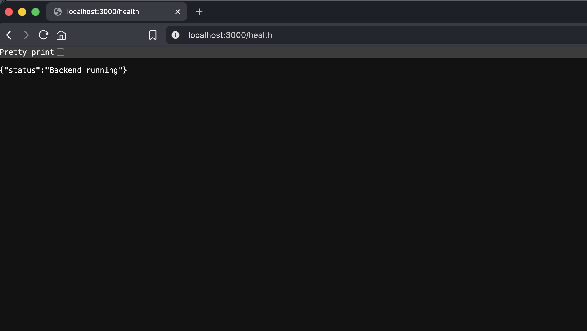
*Backend health check confirming API is live*

</div>

### Frontend — React + Vite

**Features implemented:**
- File upload interface
- Upload status and feedback display
- Responsive UI
- Cloud upload workflow integration

<div align="center">


*Frontend application running locally*

</div>

---

## 🐳 Phase 2 — Dockerization

The full application stack was containerized using Docker.

### Containerized Services

| Service | Image | Status |
|---------|-------|:------:|
| Frontend | `docu-frontend` | ✅ |
| Backend | `docu-backend` | ✅ |
| PostgreSQL | `postgres` (pinned) | ✅ |

### Build & Push Workflow

```
docker buildx build → tag with ECR URI → docker push → AWS ECR
```

<div align="center">

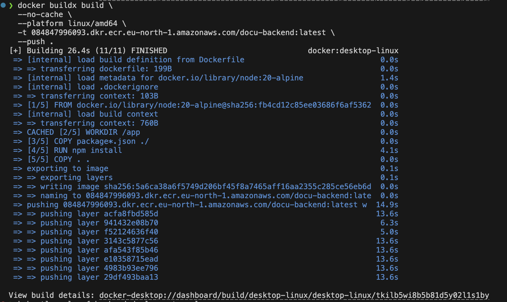
*Docker images being built and pushed to AWS ECR*

</div>

---

## ☸️ Phase 3 — Kubernetes Deployment

The application was deployed and orchestrated on Kubernetes.

### K8s Components Used

| Component | Purpose |
|-----------|---------|
| **Namespace** | Project isolation |
| **Deployment** | Pod lifecycle management |
| **Service (ClusterIP)** | Internal pod-to-pod communication |
| **Service (NodePort)** | External access |
| **Secrets** | Secure credential storage |

### Internal DNS Resolution

The backend connects to PostgreSQL using Kubernetes internal DNS — no hardcoded IPs:

```
postgresql://postgres-service:5432/docudb
```

This demonstrates pod-to-pod communication using service discovery.

### Kubernetes Secrets

AWS credentials were stored as Kubernetes Secrets — never hardcoded in manifests.

> ⚠️ All sensitive values were masked prior to documentation.

<div align="center">

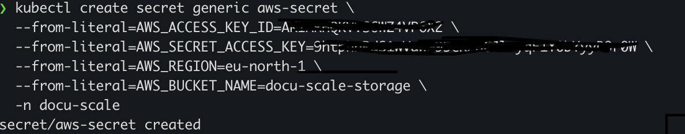
*Kubernetes Secrets securely storing AWS credentials*

</div>

## Frontend runnuning on ingress 


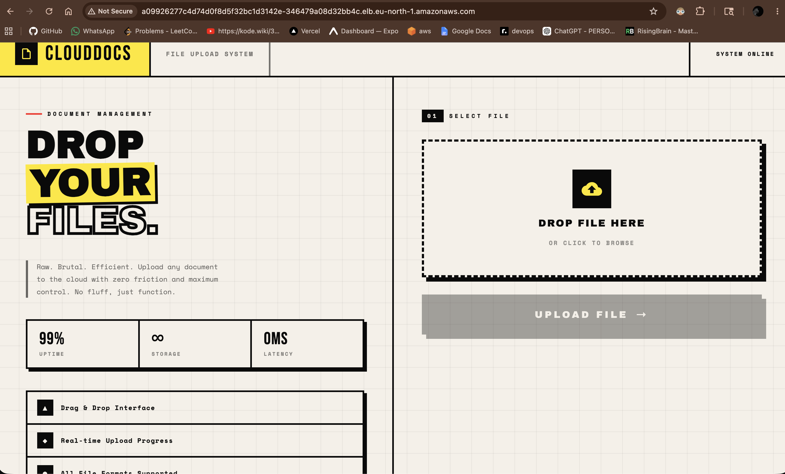
---


## ☁️ Phase 4 — AWS Cloud Infrastructure

### IAM Configuration

IAM users were created with programmatic access and minimal required permissions, following the **principle of least privilege**.

<div align="center">

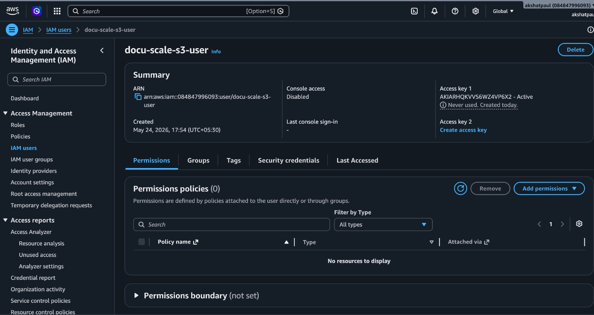
*IAM user configured with scoped permissions*

</div>

### Amazon S3 — Object Storage

S3 was used as the cloud storage backend for all uploaded files.

<div align="center">

| | |
|---|---|
| 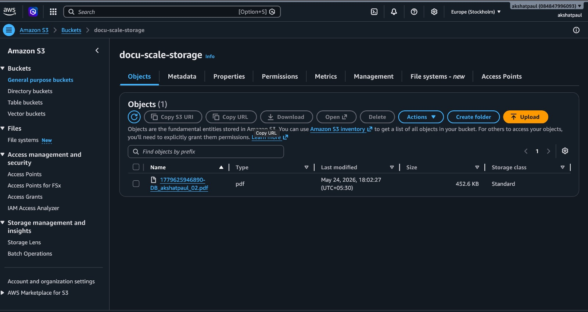 | 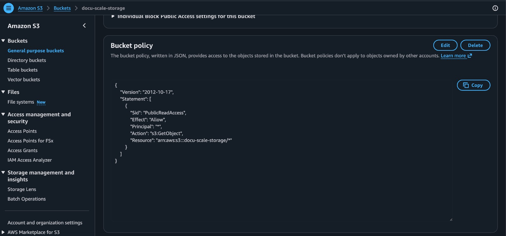 |
| *S3 Bucket Dashboard* | *S3 Bucket Policy Configuration* |

</div>

### Amazon ECR — Container Registry

Two ECR repositories were provisioned to host Docker images:

```
<account-id>.dkr.ecr.<region>.amazonaws.com/docu-backend
<account-id>.dkr.ecr.<region>.amazonaws.com/docu-frontend
```

<div align="center">

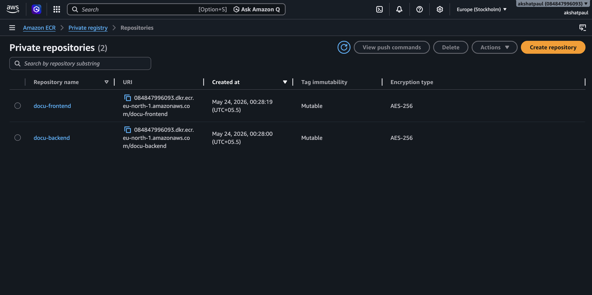
*ECR repositories hosting backend and frontend images*

</div>

### AWS EC2 — Compute

EC2 instances served as:
- Jenkins CI/CD server
- EKS worker nodes
- Kubernetes cluster infrastructure

<div align="center">

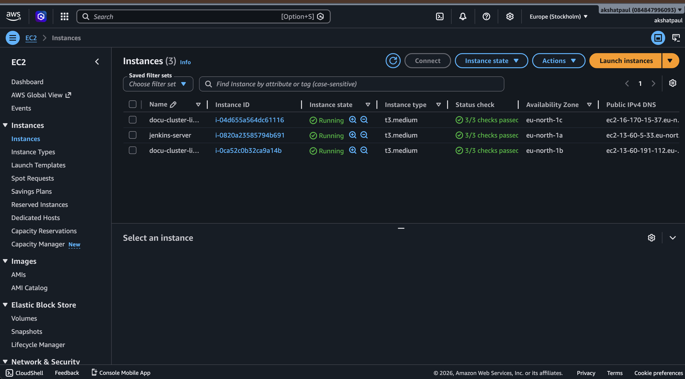
*EC2 instances running across the cluster*

</div>

---

## 🚀 Phase 5 — AWS EKS Kubernetes Cluster

Amazon EKS managed the Kubernetes control plane, worker nodes, networking, scaling, and pod scheduling.

<div align="center">

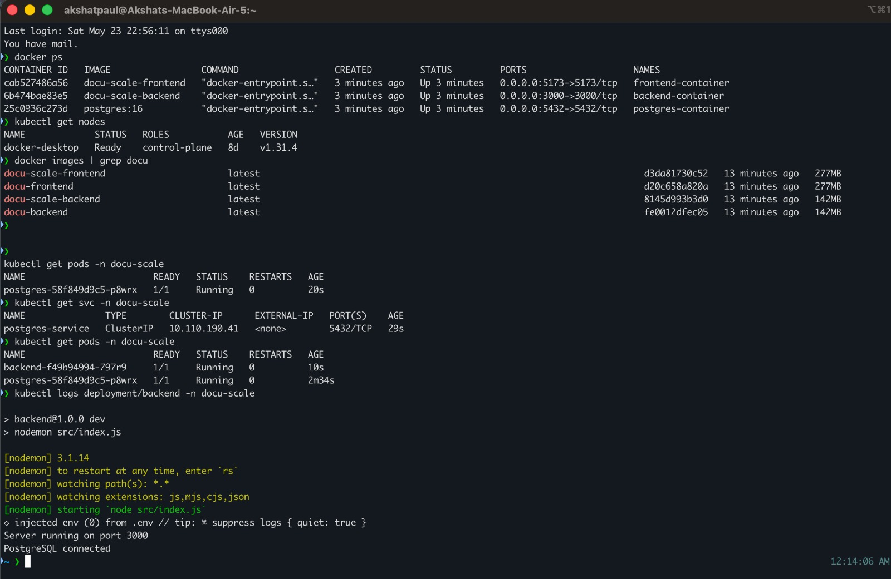
*Full cluster validation — all pods, services, and deployments running*

</div>

### Cluster Validation Confirms

```
✅ PostgreSQL deployment healthy
✅ Frontend deployment healthy
✅ Backend deployment healthy
✅ Internal DNS resolving correctly
✅ Services exposed via LoadBalancer
✅ Auto Scaling Group active
```

---

## 🔄 Phase 6 — GitHub Actions CI

GitHub Actions handles the **Continuous Integration** half of the CI/CD pipeline.

### CI Workflow

```yaml
on: [push]

jobs:
  build-and-push:
    1. Checkout source code
    2. Configure AWS credentials
    3. Log in to Amazon ECR
    4. Build Docker images (frontend + backend)
    5. Push images to ECR
```

<div align="center">

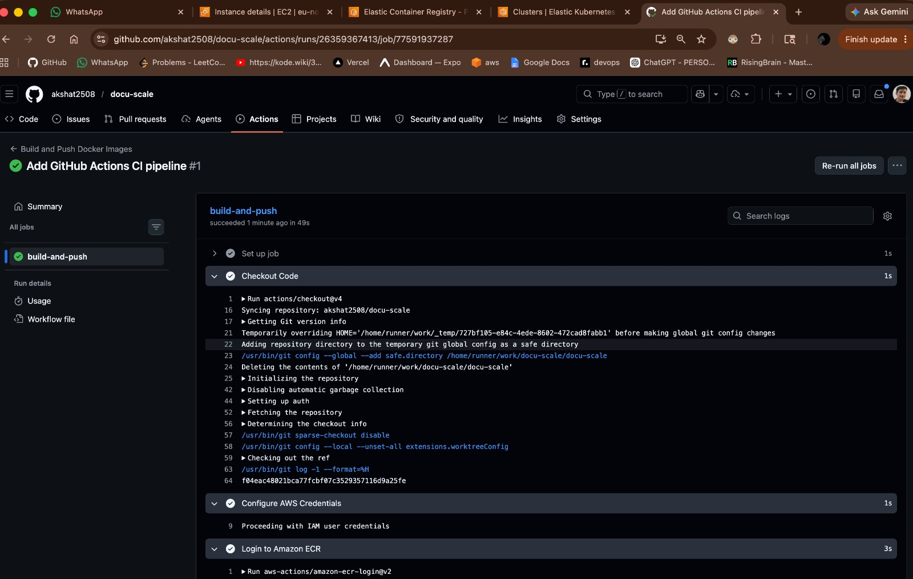
*GitHub Actions pipeline — build and push to ECR on every push*

</div>

---

## 🔧 Phase 7 — Jenkins CD

Jenkins handles **Continuous Deployment**, triggered after GitHub Actions pushes new images to ECR.

### Jenkins Setup on EC2

**Tools installed on the Jenkins EC2 instance:**

```
Java  •  Jenkins  •  Docker  •  AWS CLI  •  kubectl
```

### Jenkins Deployment Pipeline

```groovy
pipeline {
  stages {
    stage('Clone Repo')       { ... }
    stage('Apply Manifests')  { kubectl apply -f k8s/ }
    stage('Verify Deploy')    { kubectl rollout status ... }
  }
}
```

<div align="center">

| | |
|---|---|
| 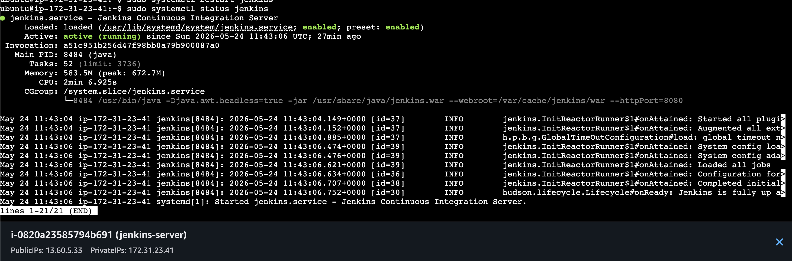 | 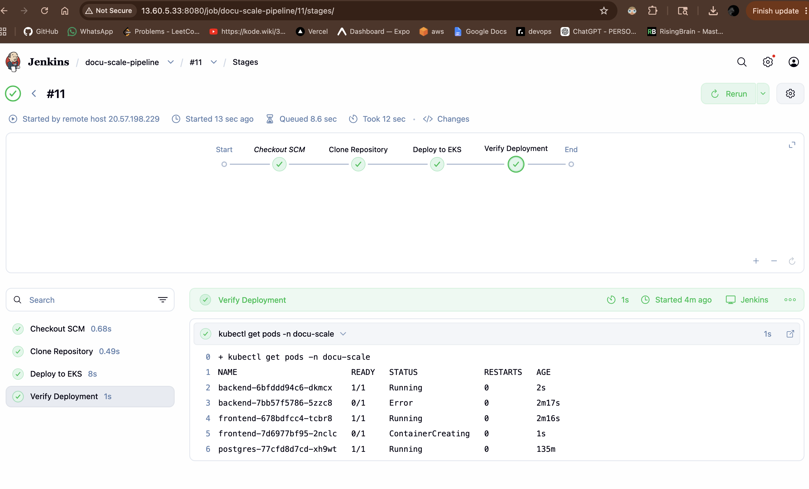 |
| *Jenkins service running via systemctl* | *Jenkins deployment pipeline — stages complete* |

</div>

---

## 🔁 Full CI/CD Flow

```
┌────────────────────────────────────────────────────────┐
│                                                        │
│   Developer  ──git push──►  GitHub                    │
│                                │                       │
│                                ▼                       │
│                    GitHub Actions  (CI)                │
│                    Build + Push to ECR                 │
│                                │                       │
│                                ▼                       │
│                    Jenkins Pipeline  (CD)              │
│                    kubectl apply → EKS                 │
│                                │                       │
│                                ▼                       │
│              Pods Rolled → Updated App Live ✅         │
│                                                        │
└────────────────────────────────────────────────────────┘
```

---

## 🛡️ Security Implementations

### IAM Security
- Dedicated IAM users (no root access used)
- Programmatic access only where required
- Least privilege permissions scoped to required services

### Kubernetes Security
- Namespace isolation
- Secrets for all credentials (never hardcoded)
- Internal ClusterIP networking for DB communication

### Docker Security
- Isolated containers per service
- Lightweight Alpine-based images
- No sensitive data in Dockerfiles or image layers

### Network Security
- VPC with private subnets for worker nodes
- ELB as the only public-facing endpoint

---

## 🌍 Linux Administration

| Command / Concept | Usage |
|-------------------|-------|
| `ssh -i key.pem` | EC2 instance access |
| `chmod 400` | PEM key permission hardening |
| `systemctl` | Jenkins service management |
| `kubectl` | Kubernetes cluster management |
| `docker ps` | Container monitoring |
| `aws` CLI | Cloud resource management |
| `eksctl` | EKS cluster provisioning |

---

## 🧪 Challenges & Debugging

### 🐛 PostgreSQL Volume Compatibility Error

**Problem:** PostgreSQL container crashed on startup with a volume incompatibility error.

**Root cause:** Existing Docker volume was created by a different PostgreSQL version — data directory format was incompatible.

**Solution:**
```bash
# Remove the old incompatible volume
docker volume rm <postgres_volume_name>

# Pin to a specific, tested PostgreSQL version in docker-compose.yml
image: postgres:15.4
```

<div align="center">


*PostgreSQL volume compatibility error — identified and resolved*

</div>

---

## 📂 Project Structure

```
docuscale/
│
├── 📁 frontend/              # React + Vite frontend
├── 📁 backend/               # Node.js + Express API
├── 📁 k8s/                   # Kubernetes manifests
│   ├── namespace.yaml
│   ├── frontend-deployment.yaml
│   ├── backend-deployment.yaml
│   ├── postgres-deployment.yaml
│   └── secrets.yaml
├── 📁 docs/
│   └── docs/screenshots/     # Project documentation images
├── 📁 .github/
│   └── workflows/            # GitHub Actions CI pipeline
├── 📄 Jenkinsfile            # Jenkins CD pipeline
├── 📄 docker-compose.yml     # Local development stack
└── 📄 README.md
```

---

## 🚀 Future Improvements

| Enhancement | Description |
|-------------|-------------|
| **Helm Charts** | Templatize all K8s manifests |
| **Terraform IaC** | Codify all AWS infrastructure |
| **ArgoCD GitOps** | Git-driven continuous delivery |
| **Prometheus + Grafana** | Full observability stack |
| **HTTPS / cert-manager** | TLS termination at ingress |
| **Horizontal Pod Autoscaling** | Dynamic pod scaling under load |
| **Blue-Green Deployment** | Zero-downtime release strategy |

---

## 🎓 Learning Outcomes

This project provided deep, hands-on experience across the full DevOps spectrum:

```
Cloud Architecture  •  Container Orchestration  •  CI/CD Design
AWS Infrastructure  •  Linux Administration      •  K8s Debugging
Security Hardening  •  Infrastructure Automation •  Production Workflows
```

---

## ✅ Final Outcome

<div align="center">

| Milestone | Result |
|-----------|:------:|
| End-to-end DevOps lifecycle | ✅ |
| Cloud-native deployment on AWS | ✅ |
| Kubernetes orchestration via EKS | ✅ |
| AWS infrastructure fully integrated | ✅ |
| GitHub Actions CI pipeline | ✅ |
| Jenkins CD pipeline | ✅ |
| Docker containerization | ✅ |
| Kubernetes Secrets & security | ✅ |
| Production-style deployment workflow | ✅ |

</div>

<br/>

<div align="center">


*DocuScale — live on AWS EKS*

</div>

---

<div align="center">

**Built by [Akshat Paul](https://github.com/akshatpaul)**

*Docker · Kubernetes · AWS · Jenkins · GitHub Actions · Linux · PostgreSQL · React · Node.js*

</div>
