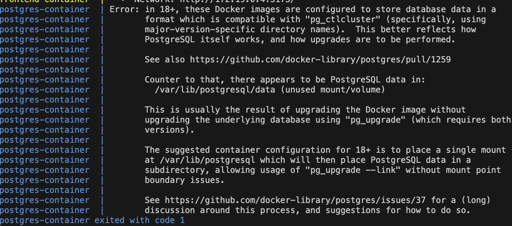

# Phase 2 — Application Containerization Using Docker

## Objective

The objective of this phase was to containerize the full-stack application using Docker in order to achieve portability, consistency, dependency isolation, and simplified deployment workflows. Containerization is a fundamental DevOps practice that enables applications to run consistently across development, testing, and production environments.

Before Dockerization, the frontend, backend, and database services relied heavily on the host machine’s local environment and manually installed dependencies. This introduced several challenges such as dependency conflicts, inconsistent runtime behavior, and difficulties reproducing the same setup across different systems.

Docker was introduced to solve these issues by packaging each application component along with its dependencies into isolated containers. This ensured that the application behaved consistently regardless of the environment in which it was executed.

This phase focused on:
- Creating Docker images for frontend and backend services
- Configuring PostgreSQL as a containerized database
- Managing inter-container communication
- Establishing container networking
- Verifying application execution through Docker
- Preparing the architecture for Kubernetes orchestration

By the end of this phase, the application was fully transformed into a portable and reproducible containerized architecture.

---

## Docker Architecture Overview

The application architecture was divided into multiple isolated containers, with each container responsible for a specific service.

### Architecture Components

### Frontend Container

The frontend application was containerized using Docker and built with Next.js. The container was responsible for:
- Rendering the user interface
- Handling client-side routing
- Communicating with backend APIs

### Backend Container

The backend service was containerized using Node.js and Express.js. The backend container handled:
- REST API requests
- Business logic processing
- Database communication
- Authentication and server-side operations

### PostgreSQL Database Container

A dedicated PostgreSQL container was used for persistent relational database storage.

The database container handled:
- Structured data storage
- Persistent application records
- Backend query execution

### Docker Networking

Docker networking enabled communication between:
- Frontend container
- Backend container
- PostgreSQL container

Containers communicated internally using Docker DNS-based service discovery.

---

## Why Docker Was Introduced

Docker was introduced to address multiple development and deployment challenges.

### Problems Before Dockerization

- Dependency inconsistencies across environments
- Manual setup complexity
- Runtime conflicts between services
- Difficulty reproducing development environments
- Environment-specific configuration issues
- Lack of deployment portability

### Benefits Achieved Through Docker

- Consistent runtime environments
- Isolated service dependencies
- Simplified deployment workflows
- Portable application architecture
- Better scalability preparation
- Easier Kubernetes integration
- Improved reproducibility

Containerization also prepared the application for future cloud deployment and orchestration using Kubernetes.

---

## Backend Dockerization

The backend application was containerized using a custom Dockerfile.

### Backend Dockerfile Responsibilities

The Dockerfile performed the following operations:
- Selected a lightweight Node.js base image
- Configured working directory
- Installed application dependencies
- Copied backend source code
- Exposed backend API ports
- Started the backend server

### Backend Image Build Process

The backend Docker image was built using Docker build commands and tagged appropriately for future deployment usage.

### Backend Container Verification

The backend container was verified by:
- Checking running container logs
- Testing API endpoints
- Verifying successful database communication

---

## Frontend Dockerization

The frontend application was also containerized using Docker.

### Frontend Dockerfile Responsibilities

The frontend Dockerfile handled:
- Installing frontend dependencies
- Creating production-ready builds
- Exposing frontend ports
- Running the Next.js application

### Frontend Container Verification

The frontend container was verified through:
- Browser accessibility testing
- Successful frontend rendering
- API communication validation

---

## PostgreSQL Container Setup

The PostgreSQL database was deployed using an official PostgreSQL Docker image.

### Database Container Responsibilities

The PostgreSQL container provided:
- Persistent data storage
- Database initialization
- Structured relational data management

### Persistent Volumes

Docker volumes were used to persist database data across container restarts and recreations.

This ensured:
- Data durability
- Persistent application state
- Database recovery capability

---

## Docker Networking and Communication

Docker networking was configured to allow communication between containers.

### Container Communication Flow

- Frontend container communicates with backend container
- Backend container communicates with PostgreSQL container
- Services communicate using container names through Docker networking

### Networking Benefits

- Internal DNS resolution
- Isolated network environment
- Secure inter-service communication
- Simplified service discovery

---

## Docker Commands Used

### Build Docker Images

```bash
docker build -t backend-image .

docker build -t frontend-image .
```

### Run Containers

```bash
docker run -p 3000:3000 frontend-image

docker run -p 5000:5000 backend-image
```

### View Running Containers

```bash
docker ps
```

### View Container Logs

```bash
docker logs <container-id>
```

### Execute Commands Inside Containers

```bash
docker exec -it <container-id> bash
```

### Docker Compose Operations

```bash
docker compose up --build

docker compose down
```

---

## Docker Compose Configuration

Docker Compose was used to simplify multi-container orchestration during local development.

### Docker Compose Responsibilities

Docker Compose automated:
- Multi-container startup
- Network creation
- Volume management
- Environment variable injection
- Service dependency handling

This significantly simplified local deployment workflows.

---

## Challenges Faced

Several challenges were encountered during the Dockerization process.

### PostgreSQL Volume Compatibility Issue

A major issue encountered during the Dockerization phase was related to PostgreSQL data volume compatibility between different PostgreSQL versions.

Initially, the PostgreSQL container was started using a newer image version while an existing Docker volume already contained database files created using an older PostgreSQL version. Because PostgreSQL data directories are tightly coupled to the internal database engine version, the container failed to start successfully.

The issue generated database initialization and compatibility errors during container startup, preventing the backend service from establishing a successful database connection.

### Root Cause

The root cause of the issue was:
- Existing Docker volume data created using a different PostgreSQL version
- Incompatible internal PostgreSQL database file structure
- Automatic reuse of persistent Docker volumes across container recreations

### Resolution Steps

The issue was resolved using the following steps:

1. Stopped all running PostgreSQL containers
2. Removed incompatible Docker volumes
3. Recreated clean PostgreSQL persistent volumes
4. Pinned the PostgreSQL image version explicitly to PostgreSQL 16
5. Restarted containers using the updated configuration

The following commands were used during troubleshooting:

```bash
docker compose down -v

docker volume ls

docker volume rm <volume-name>

docker compose up --build
```

### Preventive Improvements

To avoid similar compatibility issues in future deployments:
- PostgreSQL image versions were explicitly pinned instead of using `latest`
- Persistent volume management practices were improved
- Environment consistency between deployments was maintained

This issue provided valuable experience regarding persistent storage management, container lifecycle handling, and database version compatibility in Dockerized environments.

---

### Container Networking Issues

Initial communication failures occurred between backend and database containers due to incorrect environment variable configuration and service naming mismatches.

This issue was resolved by:
- Correcting Docker network configuration
- Updating environment variables
- Using proper Docker service names

---

### Port Conflicts

Some application ports were already occupied by local services running on the host machine.

The issue was resolved by:
- Reassigning host ports
- Stopping conflicting services
- Updating container port mappings

---

### Dependency Installation Failures

Some package dependencies initially failed during image builds due to incompatible runtime versions and missing lock files.

This issue was resolved by:
- Reinstalling dependencies
- Aligning runtime versions
- Cleaning Docker build cache

---

## Key Learnings

- Learned how Docker enables portable and reproducible application environments
- Understood container lifecycle management
- Gained experience writing Dockerfiles for frontend and backend services
- Learned how Docker networking enables inter-container communication
- Understood the role of persistent Docker volumes
- Practiced debugging container startup failures
- Learned how version compatibility affects persistent database storage
- Understood the importance of explicit image version pinning
- Gained hands-on experience with Docker Compose orchestration
- Prepared the application architecture for Kubernetes deployment

---

## Future Improvements

- Move from Docker Compose to Kubernetes orchestration
- Push Docker images to a cloud container registry
- Implement CI/CD pipelines for automated image builds
- Add health checks and monitoring
- Improve container security practices
- Optimize image sizes using multi-stage builds
- Introduce production-grade secret management

---


### Docker Desktop Running Containers

- frontend container
- backend container
- postgres container

---

### Docker Image Build Verification


```bash
docker images
```

---

### Running Containers


```bash
docker ps
```

---

### Backend Container Logs


```bash
docker logs <backend-container>
```


### PostgreSQL Volume Issue


---

### Docker Networking Verification


```bash
docker network ls
```

---

### Docker Compose Execution


```bash
docker compose up --build
```

---

## Conclusion

This phase successfully transformed the application into a fully containerized architecture using Docker. Frontend, backend, and database services were isolated into independent containers, improving portability, consistency, and deployment reproducibility.

The introduction of Docker established the foundation for Kubernetes orchestration and future cloud-native deployment workflows. Important DevOps concepts such as container lifecycle management, persistent storage handling, networking, and environment consistency were explored in depth during this phase.

The completion of this phase enabled the transition into Kubernetes-based orchestration and scalable infrastructure management.